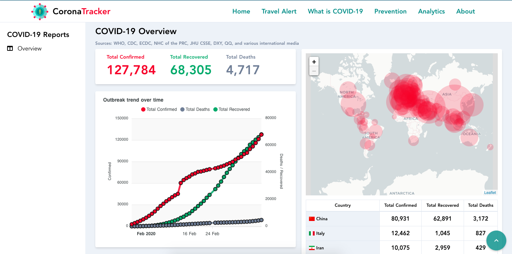

# Corona-Tracker
[CoronaTracker.com](https://www.coronatracker.com/) acts as a portal for the public to keep track of the latest news development about the COVID-19, alongside collecting data for further analysis. All the contents are handpicked, filtered, and curated by volunteers to our best extent to ensure that sources are reliable with minimal hoaxes and fake news, for the best benefit of the public. Natural Language Processing (NLP) is used to analyze trending content and identify meaningful topics over various news sources and social media platforms prior to being verified by our team.  

CORONATRACKER.com also aims to gather data for in-depth analysis (e.g. time series to monitor the growth, spread of the virus) and localized news (e.g. news related to Malaysia, or KL only). The platform is vital for information consolidation, and all gathered information is open to use for the public. This is a 100% open source project, all information and publishable data are available on Github as well. Everyone is welcomed to contribute through our telegram channel.  

Our team of data scientists uses OSEMN framework to collect, clean, explore, model, and run their own analysis. For ease of public understanding, it is presented using graphic visualizations and dashboards. Through the data obtained, we hope to build machine learning models very soon.

